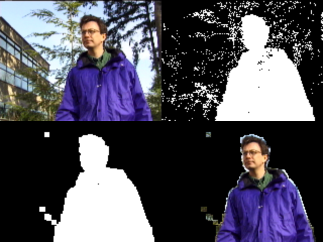

# 视频分析算法
## 基于高斯混合模型（GMM）的背景检测算法
### 1.单高斯模型
高斯分布（Gaussian distribution）有时也被称为正态分布（normal distribution），是一种在自然界大量的存在的、最为常见的分布形式。它是一个在数学、物理及工程等领域都非常重要的概率分布，在统计学的许多方面有着重大的影响力。不同参数的分布图示例如下：（图片来源于网络）


一维高斯分布的概率密度公式为：

$$
f(x)=\frac{1}{\sqrt{2 \pi} \sigma} \exp \left(-\frac{(x-\mu)^2}{2 \sigma^2}\right)
$$

其中为均值，为数据标准差，在上述分布中，每个变量都对应相应的一个概率密度，整个曲线的面积为1，同时还可以计算一个区间的概率密度。
### 2.高斯混合模型
**高斯混合模型GMM**是对单高斯模型的扩展，也是一种机器学习算法，它根据概率分布将数据分类为不同的类别。K个单高斯模型混合在一起，生成高斯混合模型，这K个子模型称为混合模型的隐变量。高斯混合模型的概率密度函数公式为：

$$
p(x \mid \theta)=\sum_{k=1}^K \alpha_k \phi\left(x \mid \theta_k\right)
$$

### 3.设计实现
#### GMM参数设置
- k：高混合斯模型中单高斯模型的个数
- lr：模型学习率
- img_size：图片尺寸大小
- sigma0：初始方差
- weight0：初始权重
- t：阈值，用于生成阈值遮罩（mask）
- mean_matrix：均值矩阵
- sigma：方差矩阵
- weight：权重矩阵
#### 初始化GMM模型init_GMM
输入为一张图片，首先创建一个与该图片相同大小的0矩阵zero_matrix（假设尺寸大小为（a，b，c）），然后对其进行维度扩展（1，a，b，c），接着在第一个维度上做重复操作，重复的次数为k-1（若k=5，则尺寸变为（4， a，b，c））。同理，创建一个与图片相同尺寸的1矩阵one_matrix，并且进行维度扩展。将原图像的像素矩阵扩展维度后与zero_matrix连接得到均值矩阵，初始方差与one_matrix相乘后与zero_matrix连接得到方差矩阵，权重矩阵由one_matrix与zero_matrix连接得到，以上连接操作均在axis=0上进行。返回均值矩阵、方差矩阵、权重矩阵。
#### 匹配高斯分布match_gaussian
每个像素都建立了混合高斯模型，因此需要判断一个像素是否匹配某个高斯分布，判断的标准是位于高斯分布的2.5倍标准差偏移内，上述操作得到match，同时在训练过程中只保留第一个匹配，因此需要对match再变化。同时如果输入了阈值遮罩矩阵，那么unmatched=1.0-np.max(match * mask, axis=0)，如果未输入那么unmatched=1.0-np.max(match, axis=0)。最终返回match和unmatched。
#### 更新GMM模型update_model
完成了对高斯分布的判断，结下来需要更新GMM的相关参数，首先计算第k个分型的概率密度，与学习率lr相乘得到fai，然后按如下公式更新相关参数。（img为图像像素矩阵，lr为学习率）
- mean_matrix = (1.0 - match) * mean_matrix + match * ((1.0 - fai) * mean_matrix + fai * img)
- sigma = (1.0 - match) * sigma + match * ((1.0 - fai) * sigma + fai * np.square(mean_matrix - img))
- weight = (1 - lr) * weight + lr * match

更新完后需要求得sigma的平均值mean_sigma，然后对-(weight / (mean_sigma + 1e-10)进行从小到大排序，得到排序索引，利用这个索引重新更新上述三个参数。最后对每个参数的末尾位置进行更新，然后对weight求和更新weight。
#### 阈值遮罩生成generate_mask
首先生成一个与权重矩阵相同大小的0矩阵，，然后根据weight，循环生成mask，对于大于阈值t的mask值设置为1，小于等于t的设置为0。再用1-mask，并且将mask的第一个位置设置为全1 矩阵，得到最终的mask。
#### 模型训练train
划分训练集与测试集，将Waving Trees前200张图片作为训练集，剩下的作为测试集，对于训练集中的每一张bmp图片，执行无mask的match_gaussian、update_model、show_images三个操作，完成对GMM模型的训练。
#### 模型测试test
对于测试集中的每一张图片执行带mask的match_gaussian、形态学操作（腐蚀和膨胀）、生成imagebox（利用show_image展示分割的结果）。同时按照视频和图像两种格式输出结果。(详细结果见视频:```BackgroundDetection/result_k5.mp4```)

## 基于均值漂移（Mean Shift）的视频目标跟踪算法
### 1.背景介绍
参密度估计属于数理统计中的一个重要分支，它与参数密度估计共同构成了概率密度估计方法。参数密度估计方法要求特征空间服从一个已知的概率密度函数，在实际的应用中这个条件很难达到。无参数密度估计对于先验知识的要求最少，通过训练数据完成估计。常见的无参数密度估计方法有：直方图法、最近邻域法、核密度估计法。

**Mean Shift**属于一种核密度估计法，相比直方图法，核密度估计法增加了用于平滑数据的核函数，这样一来，在采样充分的情况下，使用该方法能够渐进地收敛于任意的密度函数，即可以对服从任何分布的数据进行密度估计。Mean Shift在目标跟踪的应用中通过分别计算目标区域和候选区域内像素的特征值概率得到关于目标模型和候选模型的描述，接着利用相似性函数度量视频初始帧（目标模型）与当前需要跟踪的视频帧（候选模型）之间的相似性，选择相似性最大的候选模型用于计算Mean Shift向量，通过多轮的迭代这个向量，最终收敛到当前帧的目标真实位置，完成对目标的跟踪。Mean Shift在跟踪过程中会反复迭代搜索特征空间样本点最密集的区域，然后沿着密度增加的方向漂移到目标位置，跟踪示意图如下图所示（图片来源于网络）：


### 2.设计实现
Mean Shift在对目标进行跟踪过程主要包含以下步骤：
#### 目标模型
目标模型的选取主要是为了确定跟踪目标所在的区域，主要方法是通过人工框选跟踪目标。用{Zi}i=1...n表示n个像素的位置，我们将框选的区域灰度颜色空间划分为m个相等区间的灰度直方图，则目标模型 $qu$ 的概率密度可以表示为：

$$
q_u=C \sum_{i=1}^n K\left(\left\|z_i^*\right\|^2\right) \delta\left[b\left(z_i\right)-u\right]
$$

其中
$$
C=1 / \sum_{i=1}^n K\left(\left\|z_i^*\right\|^2\right)
$$
$$
z_i^*=\left(\frac{\left(x_i-x_0\right)^2+\left(y_i-y_0\right)^2}{x_0^2+y_0^2}\right)^{0.5}
$$

其中 $C$ 为归一化系数, $K$ 是核函数, 本次实验使用的是 $Epanechikov$ 核函数, $b(zi)$ 表示该像素所处的直方图区间, $u$ 是直方图颜色索引, $\delta$ 判断框选区域某个像素是否是直方图中的第 $u$ 个索引（是：1，否：0）, $z_i^*$ 是以框选区域中心为原点归一化后的像素位置。
#### 候选模型
候选模型在视频下一帧中得到，首先根据前一帧的框选目标中心f0为搜索中心，得到候选目标的中心 $f$ ，计算区域直方图，可得到候选模型的概率密度为：

$$
p_u(f)=C \sum_{i=1}^n K\left(\left\|\frac{f-z_i}{h}\right\|^2\right) \delta\left[b\left(z_i\right)-u\right] 
$$

其中 $h$ 是核函数窗口大小。
#### 相似性度量
确定了目标模型和候选模型之后，需要度量连个模型之间的相似度，以前一帧的目标中心 $f0$ 为初始搜索位置，相似度最大的位置即为当前帧的新的目标位置，在本次实验中选择了 $Bhattacharyya$ 系数作为相似性函数：

$$
\rho(p, q)=\sum_{u=1}^m \sqrt{p_u(f) q_u}
$$

#### Mean Shift迭代
均值漂移的迭代过程就是在候选模型中找到目标位置的过程，通过对 $Bhattacharyya$ 系数进行泰勒展开，得到其近似表达：

$$
\begin{aligned}
& \rho(p, q) \approx \frac{1}{2} \sum_{u=1}^m \sqrt{p_u\left(f_0\right) q_u}+\frac{C}{2} \sum_{i=1}^n w_i K\left(\left\|\frac{f-z_i}{h}\right\|^2\right) \\
& w_i=\sum_{u=1}^m \sqrt{\frac{q_u}{p_u}(f)} \delta\left[b\left(z_i\right)-u\right]
\end{aligned}
$$

上式中 $wi$ 随 $f$ 变化，则其极大化过程可以通过候选区域中心向真实目标中心的Mean Shift迭代方程完成：

$$
f_{k+1}=f_k+\frac{\sum_{i=1}^n w_i\left(f_k-z_i\right) g\left(\left\|\frac{f_k-z_i}{h}\right\|^2\right)}{\sum_{i=1}^n w_i g\left(\left\|\frac{f_k-z_i}{h}\right\|^2\right)}
$$

其中 $g(x)=-K'(x)$，在迭代过程中，当最后漂移距离小于阈值（本次实验设定为0.5）或者达到设定的最大迭代次数，则完成了Mean Shift迭代。
### 3.结果测试
见视频（```VideoObjectTracking/result.mp4```）

> 如有谬误，敬请指正，部分代码参考github代码，以及一些blog